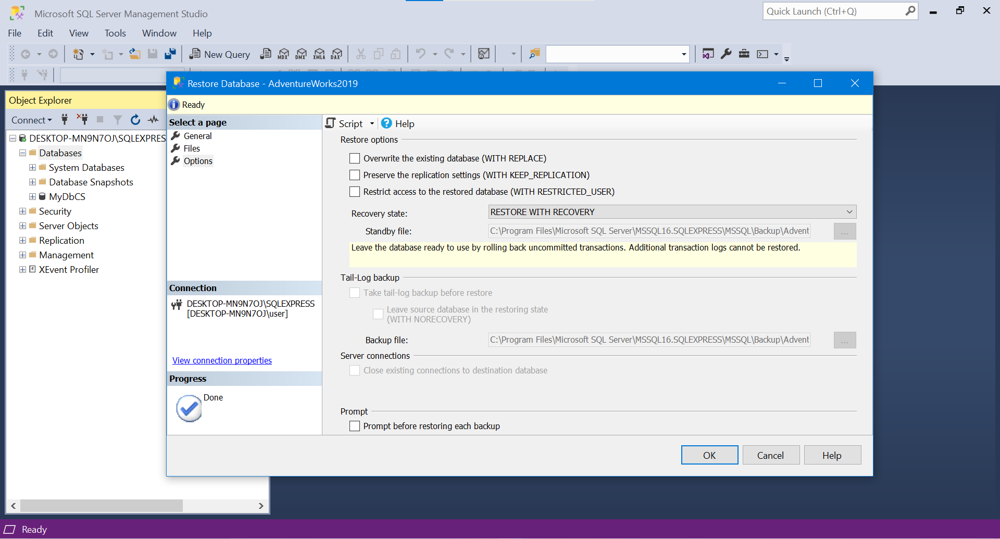

# AdventureWorks Installation Guide  

This guide provides step-by-step instructions to download, install, and set up the AdventureWorks database in SQL Server Management Studio (SSMS).

---

## Step 1: Download AdventureWorks Database  

1. Visit the official Microsoft link for AdventureWorks databases:  
   [AdventureWorks Databases](https://learn.microsoft.com/en-us/sql/samples/adventureworks-install-configure)  

2. Choose the **AdventureWorks2019** or **AdventureWorksDW** version, depending on your project requirements.  
   - **AdventureWorks2019**: Focuses on transactional and sales data.  
   - **AdventureWorksDW**: Contains data optimized for data warehousing and analytics.  

3. Download the `.bak` file to your local system.  

   >   

---

## Step 2: Open SQL Server Management Studio (SSMS)  

1. Launch **SQL Server Management Studio (SSMS)** on your computer.  
2. Connect to your SQL Server instance.  

   >   

---

## Step 3: Restore the Database  

1. In SSMS, right-click on the **Databases** folder in the Object Explorer.  
2. Select **Restore Database** from the context menu.  

   >   

3. In the **Restore Database** dialog box:  
   - Choose the **Device** option.  
   - Click on the **...** button to browse for your `.bak` file.  

   >   

4. In the **Select backup devices** window, click **Add** and locate your downloaded `.bak` file.  
5. Click **OK** to confirm.  

   >   

---

## Step 4: Configure Restore Options  

1. Ensure that the database name matches your project’s requirements (e.g., **AdventureWorks2019**).  
2. Under **Select a page**, go to **Files** and verify the database and log file paths.  

   >   

3. Under **Select a page**, go to **Options** and ensure the **Overwrite existing database** option is checked (if applicable).  

   >   

4. Click **OK** to restore the database.  

---

## Step 5: Verify Installation  

1. Once the restoration process is complete, refresh the **Databases** folder in Object Explorer.  
2. Locate and expand the newly added **AdventureWorks** database.  
3. Check for tables and other database objects to confirm the installation.  

   >   

---

## Additional Notes  

- If you encounter any errors during the installation, refer to the official Microsoft documentation :  
  [AdventureWorks Troubleshooting](https://learn.microsoft.com/en-us/sql/samples/adventureworks-install-configure).  
- Ensure that the SQL Server version supports the AdventureWorks database version you downloaded.  

---

