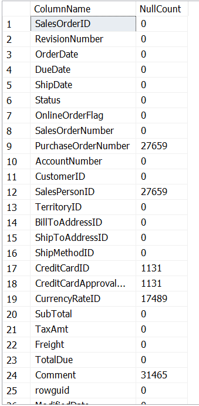
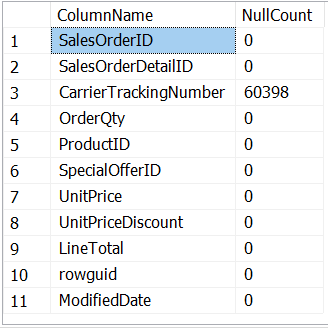
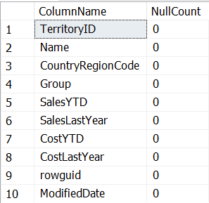

# Data Cleaning Process 

## SalesOrderHeader 

### 1. Handling Missing Values

After executing the [missing values script](../Data%20Cleaning/SalesOrderHeader/missing_values.sql), a table showing null value counts for each column was generated. Here are the findings:

> 

- **Columns with Optional Data:**  
  The following columns contain missing values but are optional and may not significantly impact the analysis:  
  - `PurchaseOrderNumber`  
  - `CreditCardID`  
  - `CreditCardApprovalCode`  
  - `CurrencyRateID`  
  - `Comment`

- **Columns with High Missing Values:**  
  - The column `SalesPersonID` has a large proportion of missing data. Rows with null values in this column were removed to improve data quality and ensure the dataset's reliability.

---

### 2. Checking for Duplicate Values

A [script to check for duplicate rows](../Data%20Cleaning/SalesOrderHeader/duplicates_values.sql) was executed to ensure there are no identical records in the `SalesOrderHeader` table.  
- **Result:** No duplicate records were found in the dataset.


### 3. Extracting Important Columns

To focus on relevant data for the analysis, the following columns were selected:  
- `SalesOrderID`: Unique identifier for each order.  
- `OrderDate`: Date when the order was placed.  
- `DueDate`: Expected processing date for the order.  
- `ShipDate`: Actual shipment date.  
- `CustomerID`: Identifier of the customer.  
- `SalesPersonID`: Identifier of the salesperson associated with the order.  
- `TerritoryID`: Identifier of the sales territory.  
- `Freight`: Shipping charges.  
- `TotalDue`: Total amount due from the customer.  
- `OrderYear`: Extracted year from the order date.  
- `OrderMonth`: Extracted month from the order date.

 **Script for Extracting Important Columns:**  

```sql
SELECT 
    SalesOrderID,
    OrderDate,
    DueDate,
    ShipDate,
    CustomerID,
    SalesPersonID,
    TerritoryID,
    Freight,
    TotalDue,
    YEAR(OrderDate) AS OrderYear,
    MONTH(OrderDate) AS OrderMonth
FROM 
    [AdventureWorks2019].[Sales].[SalesOrderHeader];
```

This script is available [here](../Data%20Cleaning/SalesOrderHeader/extract_important_columns.sql).

### 4. Saving Results for Power BI

Finally, we save the results of the important columns extraction script as a `.csv` file. This file will be used as input for further analysis and visualization in Power BI.

This csv file is available [here](../Data%20Cleaning/SalesOrderHeader/sales_order_header.csv)


---


## SalesOrderDetail   


### 1. Identifying Missing Values  

To begin cleaning the `SalesOrderDetail` table, we executed a SQL script to identify the missing values in each column.  

The script can be found [here](../Data%20Cleaning/SalesOrderDetail/missing_values.sql).  


  >


The `CarrierTrackingNumber` column contains a large number of missing values. However, since this column is not essential for our analysis, we will exclude it from further processing.

### 2. Checking for Duplicate Values

A [script to check for duplicate rows](../Data%20Cleaning/SalesOrderDetail/duplicates_values.sql) was executed to ensure there are no identical records in the `SalesOrderDetail` table. 

- **Result:** After executing the script, no duplicate values were found in the `SalesOrderDetail` table. This indicates that all rows in the table are unique based on the selected key columns.  

### 3. Extraction Important Columns

To focus on relevant data for the analysis, the following columns were selected from the `SalesOrderDetail` table:

- `SalesOrderID`: Unique identifier linking the sales order detail to the sales order header.
- `SalesOrderDetailID`: Unique identifier for each line item in the sales order.
- `OrderQty`: Quantity of the product ordered.
- `ProductID`: Identifier for the product ordered.
- `UnitPrice`: Price per unit of the product.
- `UnitPriceDiscount`: Discount applied per unit.
- `LineTotal`: Total amount for the line, calculated as `OrderQty * (UnitPrice - UnitPriceDiscount)`.

**Script for Extracting Important Columns:**

```sql
SELECT 
    SalesOrderID,           -- Foreign key linking to the SalesOrderHeader table
    SalesOrderDetailID,     -- Unique identifier for each line item in the sales order
    OrderQty,               -- Quantity of the product ordered
    ProductID,              -- Product identifier
    UnitPrice,              -- Price per unit of the product
    UnitPriceDiscount,      -- Discount applied per unit
    LineTotal               -- Total amount for the line
FROM 
    [AdventureWorks2019].[Sales].[SalesOrderDetail];  -- Table containing the sales order details

```
This script is available [here](../Data%20Cleaning/SalesOrderDetail/extract_important_columns.sql)


### 4. Saving Results for Power BI

Finally, we save the results of the important columns extraction script as a `.csv` file. This file will be used as input for further analysis and visualization in Power BI.

This csv file is available [here](../Data%20Cleaning/SalesOrderDetail/sales_header_detail.csv)

---


## SalesTerritory

### 1. Identifying Missing Values  

To begin cleaning the `SalesTerritory` table, we executed a SQL script to identify the missing values in each column.  

The script can be found [here](../Data%20Cleaning/SalesTerritory/missing_values.sql).  

>   

After running the script, we found that there are no missing values in the `SalesTerritory` table. All columns are complete and ready for further processing.
 
### 2. Checking for Duplicate Values

A [script to check for duplicate rows](../Data%20Cleaning/SalesTerritory/duplicate_values.sql) was executed to ensure there are no identical records in the `SalesTerritory` table. 

- **Result:** After executing the script, no duplicate values were found in the `SalesTerritory` table. This indicates that all rows in the table are unique based on the selected key columns.  

### 3. Extraction of Important Columns

To focus on relevant data for the analysis, the following columns were selected from the `SalesTerritory` table:

- `TerritoryID`: Unique identifier for the territory, used as a primary key and for linking to the `SalesOrderHeader` table.
- `Name`: Name of the territory, useful for region-based analysis.
- `CountryRegionCode`: Code representing the country or region, facilitating geographical analysis.
- `[Group]`: Geographical category of the territory (e.g., North America, Europe).
- `SalesYTD`: Year-to-date sales revenue, allowing for regional performance comparisons.
- `SalesLastYear`: Sales revenue from the previous year, helpful for trend analysis.
- `CostYTD`: Year-to-date costs in the territory, used to evaluate profitability.
- `CostLastYear`: Costs from the previous year, enabling cost variation analysis.

**Script for Extracting Important Columns:**

```sql
SELECT 
    TerritoryID,            -- Unique identifier for the territory
    Name,                   -- Territory name
    CountryRegionCode,      -- Country or region code
    [Group],                -- Geographical group (e.g., North America, Europe)
    SalesYTD,               -- Year-to-date sales revenue
    SalesLastYear,          -- Sales revenue from the previous year
    CostYTD,                -- Year-to-date costs
    CostLastYear            -- Costs from the previous year
FROM 
    [AdventureWorks2019].[Sales].[SalesTerritory];  -- Table containing the sales territory data
```
This script is available [here](../Data%20Cleaning/SalesTerritory/extract_important_columns.sql)


### 4. Saving Results for Power BI

Finally, we save the results of the important columns extraction script as a `.csv` file. This file will be used as input for further analysis and visualization in Power BI.

This csv file is available [here](../Data%20Cleaning/SalesTerritory/sales_territory.csv)


--- 


## Additional Tables and Joins for Further Analysis  

After successfully cleaning the essential tables, additional tables are needed to enrich the analysis and generate meaningful insights. The following joins were performed to extract relevant data from related tables:

---

### Joining `Customer` and `Person` Tables  

This join provides detailed customer information, including their names, titles, and email promotion preferences. It helps link sales data to specific customers for personalized analysis.

**Script for Joining Customer and Person Tables:**  

```sql
SELECT 
    c.CustomerID,                  -- Unique identifier for the customer
    c.TerritoryID,                 -- Sales territory identifier
    p.Title,                       -- Title of the person (e.g., Mr., Ms.)
    p.FirstName,                   -- First name of the person
    p.LastName,                    -- Last name of the person
    p.EmailPromotion               -- Email promotion subscription status
FROM 
    [AdventureWorks2019].[Sales].[Customer] AS c  -- Customer table
JOIN 
    [AdventureWorks2019].[Person].[Person] AS p ON c.PersonID = p.BusinessEntityID;  -- Join on PersonID
```

Script available [here](../Data%20Cleaning/Customer/join_customer_person.sql).
This csv file is available [here](../Data%20Cleaning/Customer/customer.csv)

---

### Joining `SpecialOfferProduct` with Product and Categories  

This join enriches product data with information about special offers, product details, subcategories, and categories. It is crucial for analyzing the performance of promotional campaigns.

**Script for Joining SpecialOfferProduct and Related Tables:**  

```sql
SELECT 
    sop.SpecialOfferID,
    sop.ProductID,                     -- Unique identifier for the product associated with a special offer
    p.Name AS ProductName,             -- Name of the product
    p.ProductNumber,                   -- Product reference number
    p.Color,                           -- Product color
    p.StandardCost,                    -- Standard cost of the product
    p.ListPrice,                       -- List price of the product
    p.SellStartDate,                   -- Product sale start date
    p.SellEndDate,                     -- Product sale end date (if applicable)
    ps.Name AS SubcategoryName,        -- Product subcategory name
    pc.Name AS CategoryName            -- Product category name
FROM 
    [AdventureWorks2019].[Sales].[SpecialOfferProduct] AS sop  -- Table linking products to special offers
LEFT JOIN 
    [AdventureWorks2019].[Production].[Product] AS p ON sop.ProductID = p.ProductID  -- Join to retrieve product details
LEFT JOIN 
    [AdventureWorks2019].[Production].[ProductSubcategory] AS ps ON p.ProductSubcategoryID = ps.ProductSubcategoryID  -- Join to link subcategory
LEFT JOIN 
    [AdventureWorks2019].[Production].[ProductCategory] AS pc ON ps.ProductCategoryID = pc.ProductCategoryID;  -- Join to link category
```

Script available [here](../Data%20Cleaning/SpecialOfferProduct/Join_specialOfferProduct_product.sql).
This csv file is available [here](../Data%20Cleaning/SpecialOfferProduct/specialOffer_product.csv).


---

### Joining `SalesPerson` and `Employee` Tables  

This join provides insights into salesperson performance and demographic data, such as sales quotas, bonuses, and hire dates, enabling performance evaluations and trend analyses.

**Script for Joining SalesPerson and Employee Tables:**  

```sql
SELECT 
    sp.BusinessEntityID,        -- Unique identifier for the employee in the system
    sp.TerritoryID,             -- Sales territory identifier
    sp.SalesQuota,              -- Sales quota assigned to the employee
    sp.Bonus,                   -- Bonus received by the employee
    sp.CommissionPct,           -- Commission percentage assigned to the employee
    sp.SalesYTD,                -- Year-to-date sales revenue
    sp.SalesLastYear,           -- Sales revenue from the previous year
    e.JobTitle,                 -- Job title of the employee
    e.HireDate,                 -- Hire date of the employee
    e.Gender                    -- Gender of the employee
FROM 
    [AdventureWorks2019].[Sales].[SalesPerson] AS sp  -- Table with salesperson performance data
JOIN 
    [AdventureWorks2019].[HumanResources].[Employee] AS e ON sp.BusinessEntityID = e.BusinessEntityID;  -- Join on Employee ID
```

Script available [here](../Data%20Cleaning/SalesPerson/join_salesperson_employee.sql).
This csv file is available [here](../Data%20Cleaning/SalesPerson/sales_person.csv)

---


## Next Steps  

Once the data cleaning and preparation are complete, proceed to:  
[Creating Visualizations with Power BI](../Documentation/DataVisualization.md) to transform the cleaned data into interactive and insightful visualizations for analysis.


