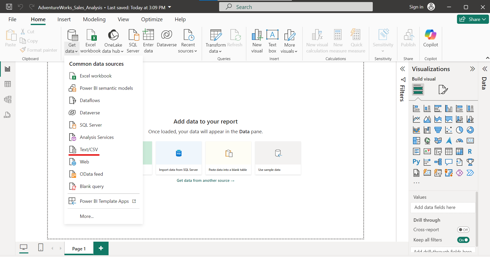

# Data Visualization with Power BI

## **ETL Process in Power BI**

### **1. Uploading Data (CSV/File)**

To begin the data visualization process, we first need to load the data into Power BI. This can be done by uploading the cleaned CSV files generated from the SQL scripts.

1. **Step 1**: Open Power BI Desktop and click on "Home" in the top ribbon.
2. **Step 2**: Click on "Get Data" and select "CSV" (or the appropriate file type).

3. **Step 3**: Browse to the location of your CSV file (e.g., `SalesOrderHeader.csv`) and select it for upload.

After uploading the file, you will see a preview of the data in Power BI.

---

### **2. Transform Data**

Once the data is loaded, you can click on "Transform Data" to open the Power Query Editor, where you can clean and transform the data before it is used in the report.

1. **Step 1**: In the Power Query Editor, you'll see all the columns and rows of the uploaded data.

2. **Step 2**: Verify the data and perform necessary transformations, such as renaming columns, changing data types, and adding new columns.

3. **Step 3**: Once you're satisfied with the changes, click "Apply & Close" to return to the main Power BI interface.

---

### **3. Create Relationships Between Tables**

To build a meaningful data model, it is essential to create relationships between different tables in your data. This step ensures that Power BI can correctly link data from different sources (e.g., `SalesOrderHeader` and `SalesOrderDetail`).

1. **Step 1**: In Power BI, go to the "Model" view by clicking on the "Model" icon on the left-hand side.
2. **Step 2**: You will see a diagram of your tables. Drag and drop the relevant fields to create relationships (e.g., linking `SalesOrderID` in `SalesOrderHeader` to `SalesOrderID` in `SalesOrderDetail`).

3. **Step 3**: After setting the relationships, make sure to configure the relationship properties (e.g., cardinality and direction of filtering) to ensure the correct data flow.

---

### **4. Creating Dashboard Pages**

Once the data is loaded, transformed, and relationships are established, you can now create your visualizations in Power BI. Here are the visualizations we have created, each with its respective page and screenshots:

#### **Page 1: Home (OverView)**

#### **Page 2: Product**

#### **Page 3: Customer**

#### **Page 4: Employee**

#### **Page 5: sales map**

#### **Page 6: Pays**

#### **Page 7: Time**

---

## **Conclusion**

With the data cleaned, transformed, and visualized in Power BI, you can now use the insights gained from the interactive reports and dashboards to make informed decisions. The visualizations provide a clear overview of the data, and the relationships between tables ensure that the reports are accurate and meaningful.

---

Next steps:  
[Add Predictive Analytics Part ](../Documentation/PredictiveAnalytics.md)
