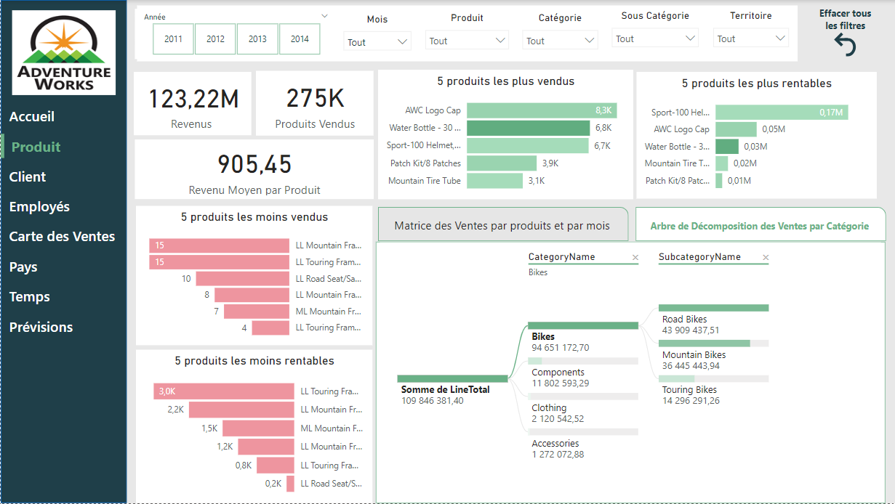
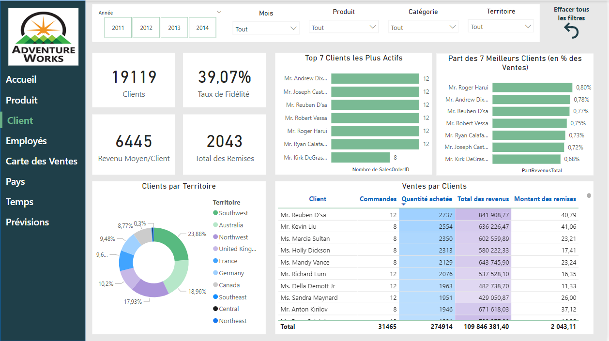
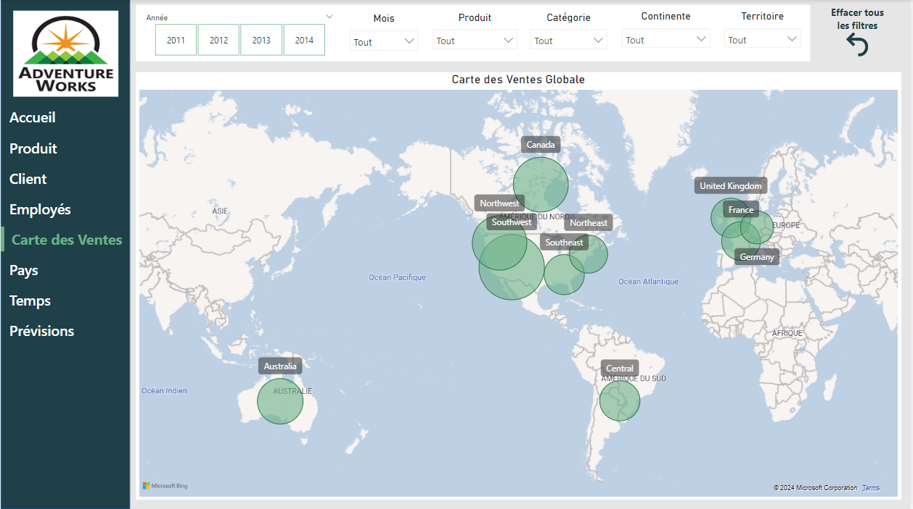

# Project: AdventureWorks Sales Analysis 

## Project Description  
This project aims to work with the AdventureWorks database to develop skills in data management, cleaning, visualization, and collaborative teamwork Our team focuses specifically on the sales domain to analyze performance and create insightful dashboards.  

---

## This Project is Executed By:  
- **[EL HARKAOUI Meriem](https://github.com/Elharkaoui-Meriem)**  
- **[OUABBI Mohamed](https://github.com/mouabbi)**  

---

## 📝 Project Steps  

1. **Download and Install AdventureWorks**  
   - Download the appropriate version of the database from [AdventureWorks Databases](https://learn.microsoft.com/en-us/sql/samples/adventureworks-install-configure).  
   - Import the `.bak` file into SQL Server Management Studio (SSMS) to install the database.  
   - View detailed instructions with screenshots and links here: [AdventureWork Installation](Documentation/AdventureWorksInstallation.md)

2. **🔍 Table Exploration**  
   - [Refer to Tables Assignments and Documentation](Documentation/TablesExploration.md).  

3. **🧹 Data Cleaning and Quality Assurance**  
   - [Refer to Data Cleaning Guidelines](Documentation/DataCleaning.md).  

4. **📊 Data Visualization with Power BI**  

 - ### **Dashboard pages:** 
   
   #### **Page 1: Home (OverView)**
   
   
   
   
   #### **Page 2: Product**
   
   
   
   #### **Page 3: Customer**
   
   
   
   #### **Page 4: Employee**
   
   
   
   #### **Page 5: sales map**
   
   
   
   #### **Page 6: Pays**
   
   
   
   #### **Page 7: Time**
   
   

   
   - For more detailed information, visit: [Data Visualization Documentation](Documentation/DataVisualization.md).  

---

## 🛠️ Tools Used:  

- **SQL Server** 🔲  
- **Power BI** 📊  

---

🔗 **Contact Me:**  
[📧 Email](mailto:mohamedouabbi7@gmail.com) | [🔗 LinkedIn](https://www.linkedin.com/in/mohamed-ouabbi/)  

✨ **Analyzing today to shape a smarter tomorrow!**  
